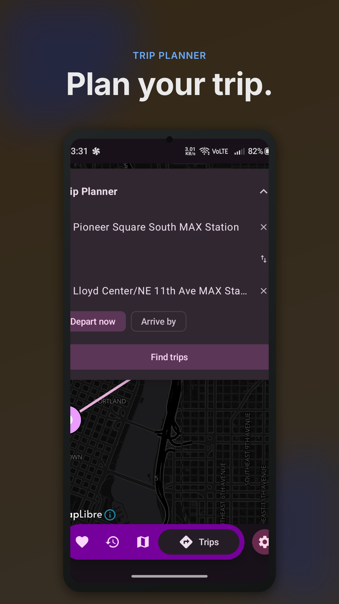
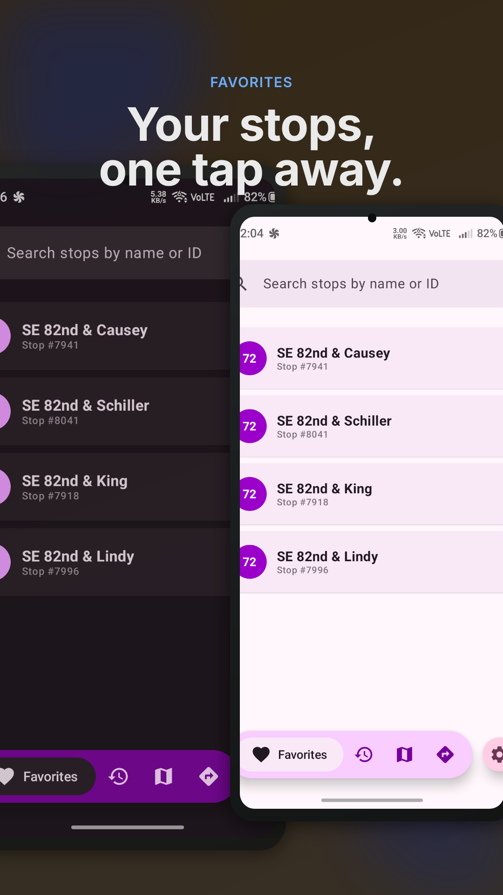
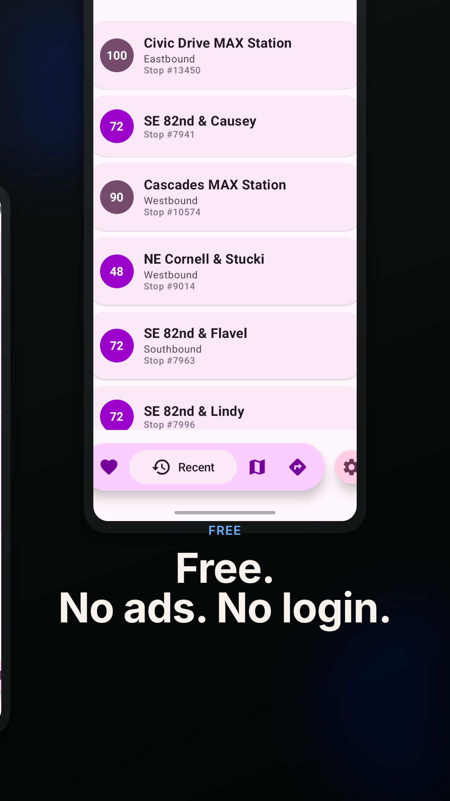
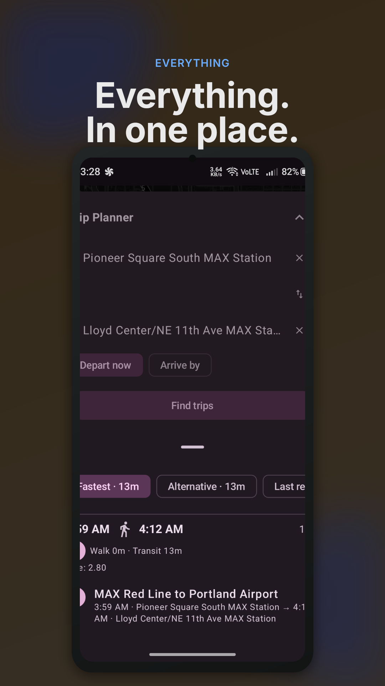

# PDX Bus Tracker

Real-time transit for Portland, OR's TriMet system: bus, MAX Light Rail, Streetcar, and WES, plus a trip planner that draws your options on a map. Built with Jetpack Compose and Material 3.

PDX Bus Tracker is an unofficial, community-built app. It is not affiliated with, sponsored by, or endorsed by TriMet. "TriMet" and "TransitTracker" are trademarks of the Tri-County Metropolitan Transportation District of Oregon, used here only to name the transit service this app reads data from. TriMet's logos are not used, and all transit data remains the property of TriMet.

*TriMet and TransitTracker are registered trademarks of TriMet. All rights reserved.*

## Features

- **Live arrivals.** See when the next bus, train, or MAX leaves any stop. Pull to refresh, and the list refreshes itself when you come back to the app.
- **Trip Planner.** Pick a start and an end point by tapping the map, searching stops, or using your current location. Choose depart-now or arrive-by, and compare itinerary options drawn over the map.
- **Route & stop browser.** Drill from routes to directions to stops in an animated accordion.
- **Nearby stops.** Find stops around where you are, and search stops by name right from the Home screen (the local stop list stays usable offline).
- **Favorites & recent stops.** Bookmark stops and step back to them in a tap. Everything is stored on your device in SQLite, and saved stops always land on the Favorites tab.
- **Detours on arrival cards.** TriMet detour notices for a stop's routes appear as small badges right on the arrival rows.
- **Floating pill navigation.** A compact pill bar keeps Favorites, Recent, Routes, Trips, and Settings within reach.
- **Picture-in-picture.** Keep an arrival countdown in a floating mini-window while you use other apps.
- **Dynamic theming.** Material 3 follows your system theme, with light and dark overrides in Settings.
- **Route-pinned mode.** Optionally show only the arrivals for the route you opened a stop from.

## Screenshots

| | | | |
|---|---|---|---|
|  |  |  |  |
| Real-time arrivals | Trip Planner | Search stops | Route & stop browser |
|  |  |  | |
| Favorites (light & dark) | Recent stops | Trip results | |

## Requirements

- Android 12 or newer (minSdk 31)
- JDK 21
- Android SDK platform 37

## Architecture

The app is 12 Gradle modules in five layers with strictly downward dependencies: a module can depend on the layers below it, never above it, and no feature depends on another feature.

| Layer | Modules |
|---|---|
| `app` | Launcher, single activity, navigation, floating pill bar, picture-in-picture |
| `feature/*` | `home`, `stops`, `trips`, `arrivals`, `settings` (one screen area per module) |
| `component/*` | `transit` (TriMet API client: OkHttp + JSON/XML parsing, including the Trip Planner web service), `localdata` (SQLite favorites/recent stops) |
| `common/*` | `model` (domain models), `utils` (connectivity, date helpers), `ui` (theme, shared components), `map` (shared MapLibre map host) |

There are no ViewModels, no DI framework, and no Room. Screens keep their own state and call the API functions directly.

## Building

1. **Prerequisites:** JDK 21 and Android SDK platform 37.
2. **Get an API key.** Register for a free key at [developer.trimet.org](https://developer.trimet.org/appid/registration/). You only need it for real-time data; the app builds fine without one.
3. **Set the key** (either works):
   ```sh
   export TRIMET_API_KEY=your_key_here
   # or
   ./gradlew assembleDebug -PTRIMET_API_KEY=your_key_here
   ```
4. **Build the debug APK:**
   ```sh
   ./gradlew assembleDebug
   ```
5. **Find the APK** at `app/build/outputs/apk/debug/`.
6. **Run the repo's full check** (tests, lint, and a debug build):
   ```sh
   ./gradlew clean test lint assembleDebug --stacktrace
   ```

### Release builds

Release builds are signed with a local keystore (`app/release.keystore`, not checked in). Set the signing credentials as environment variables; the build fails fast if they are missing:

```sh
export STORE_PASSWORD=... KEY_ALIAS=... KEY_PASSWORD=...
./gradlew assembleRelease bundleRelease
```

- **Signed APK:** `app/build/outputs/apk/release/` (a copy named `PdxBusTracker-release-<version>.apk` also lands in `app/build/outputs/renamed_apks/release/`)
- **Android App Bundle (what Play Console accepts):** `app/build/outputs/bundle/release/app-release.aab`

**Publishing a GitHub release:** bump `versionName` and add a "What's New" section to the changelog, commit and push, then run `scripts/release.sh`. It reads the version from `app/build.gradle.kts`, pulls the latest changelog section, and publishes the release with the signed APK attached (requires the `gh` CLI). `--dry-run` prints what it would do without publishing.

For a local smoke test without real credentials, build with `-PreleaseSigningFallback=true`. Never upload a build signed with the fallback keystore.

## Tech stack

| Stack | Version |
|---|---|
| Gradle / AGP | 9.7.1 / 9.4.0 |
| Kotlin / Compose compiler plugin | 2.4.20 |
| Jetpack Compose | BOM 2026.09.00 (Material 3 1.5.0-alpha28, Navigation 2.10.1) |
| OkHttp | 5.5.0 |
| Joda-Time (android.joda) | 2.14.2.1 |
| Kotlin coroutines | 1.11.0 |
| MapLibre GL Native (OpenGL backend) | 13.6.1 + OpenFreeMap tiles |

## Privacy

PDX Bus Tracker collects no accounts, no analytics, and no advertising data. Location stays on your device, except that browsing nearby stops or planning a trip from where you are sends your coordinates to TriMet's public API to find stops and routes near you. Full details: [Privacy Policy](docs/privacy-policy.md).

## License

This project is licensed under the MIT License. See [LICENSE](LICENSE). Third-party libraries keep their own licenses; see [THIRD-PARTY-NOTICES.md](THIRD-PARTY-NOTICES.md) for the list. Basemap tiles come from [OpenFreeMap](https://openfreemap.org/) (OpenStreetMap data), with attribution shown in the app.

The launcher icon is original artwork: route lines drawn by hand over aerial imagery of Portland from the [USGS National Map](https://basemap.nationalmap.gov/), which is U.S. Geological Survey public-domain material.

TriMet data remains the property of TriMet. PDX Bus Tracker is an unofficial project; TriMet does not sponsor, endorse, or maintain it.