# PDX Bus Tracker

Real-time transit tracker for Portland, OR's TriMet system — bus, MAX Light Rail, Streetcar, and WES Commuter Rail — built with Jetpack Compose + Material 3.

*PDX Bus Tracker is an unofficial, community-built app. It is not affiliated with, sponsored by, or endorsed by TriMet. "TriMet" and "TransitTracker" are trademarks of the Tri-County Metropolitan Transportation District of Oregon; they are referenced here solely to identify the transit service the app reads data from. TriMet's logos are not used, and all transit data remains the property of TriMet.*

## Features

- **Real-time arrivals** — live departure countdowns at any stop, per-run bus positions on a map card, pull-to-refresh, and auto-refresh when the app returns to the foreground
- **Trip Planner** — plan a from-A-to-B trip right on the map: pick an origin and destination by tapping the map, searching stops, or using your current location; choose depart-now or arrive-by and compare itinerary options whose routes are drawn over the basemap
- **Route & stop browser** — routes → directions → stops in an animated accordion drill-down
- **Nearby stops** — find stops around your current GPS location
- **Stop search** — instant client-side search by name, right on the Home screen
- **Favorites & recent stops** — saved locally in SQLite; the Favorites pill always lands on the Favorites tab
- **Floating pill navigation** — a Material 3 Expressive pill bottom bar with a fixed Favorites / Recent / Routes / Trips item set, swipeable screens, and a trailing Settings button (becomes a Back button on Settings)
- **Service alerts & detours** — active TriMet alerts for the stop and its routes
- **Picture-in-picture** — mini-window countdown on the arrivals screen (2:3 PiP)
- **Dynamic theming** — Material 3 with Android 12+ dynamic color; system/light/dark override in Settings
- **Route-pinned mode** — optional setting to show only the arrivals for the route you opened the stop from
- **Wear OS companion** — optional watch app mirroring your Favorites & Recent stops (synced automatically over the paired connection) with tap-through to live arrivals on the watch

## Screenshots

| | | | |
|---|---|---|---|
| 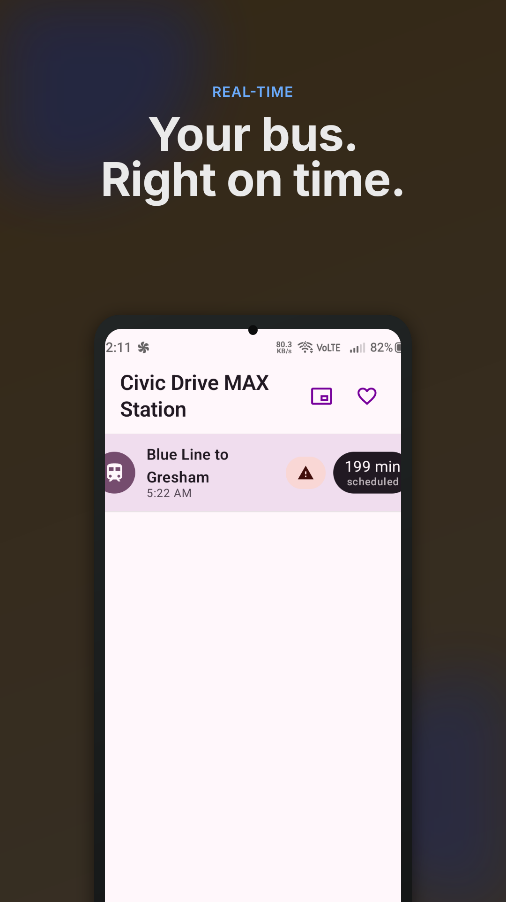 | 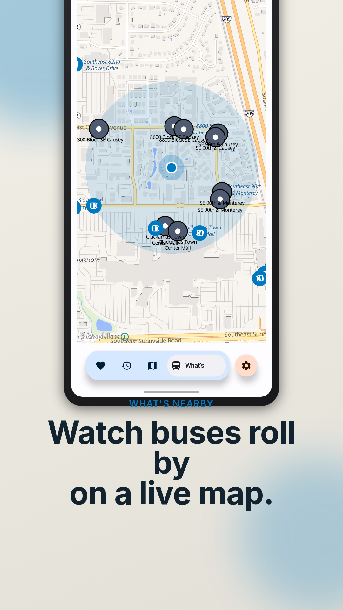 | 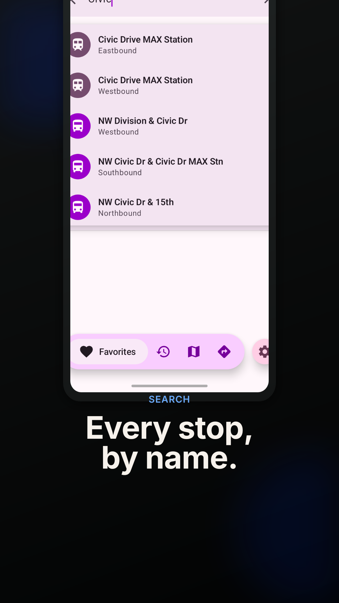 | 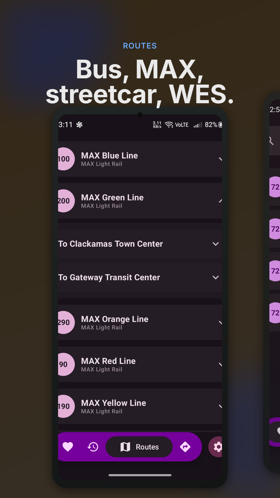 |
| Real-time arrivals | What's Nearby live map | Search stops | Route & stop browser |
| 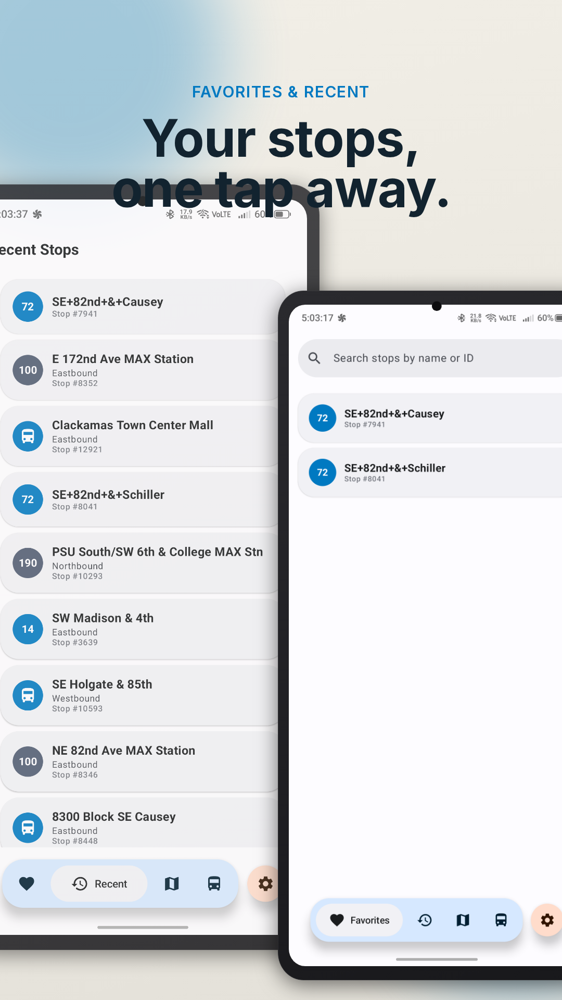 | 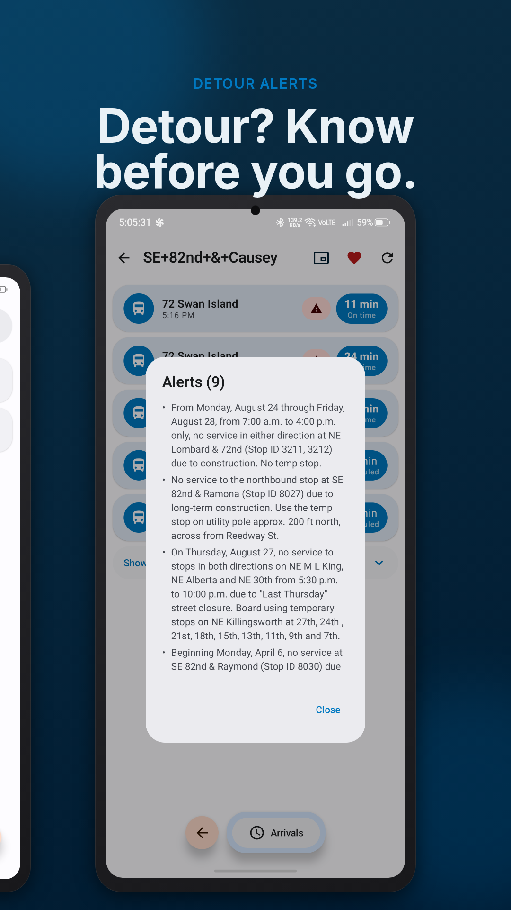 | 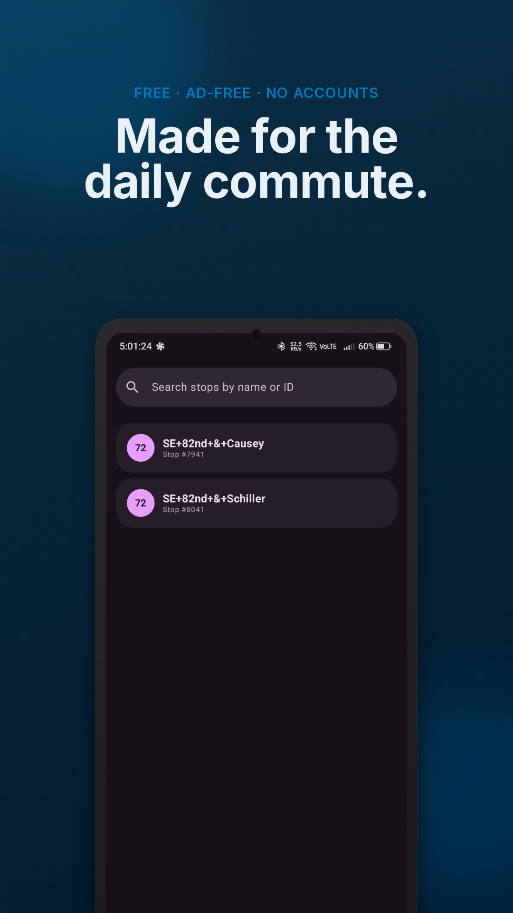 | 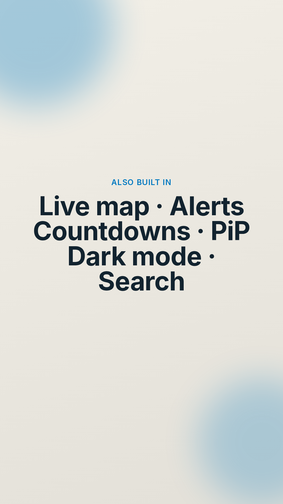 |
| Favorites & recent stops | Detour alerts | Free, no ads | Everything in one place |

### Wear OS companion

| | | |
|---|---|---|
| 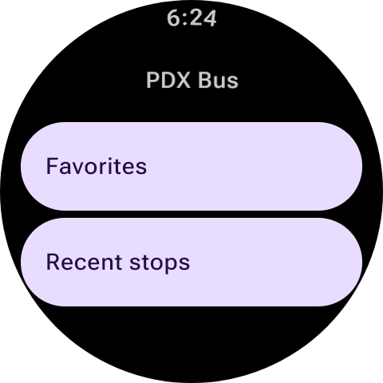 | 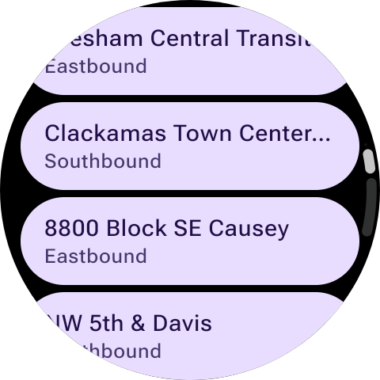 | 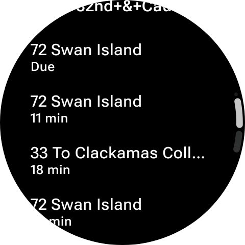 |
| Live arrivals | Favorites | Recent stops |

## Requirements

- Android 12+ (minSdk 31, targetSdk/compileSdk 37)
- JDK 21 (locally and in CI)
- Android SDK platform 37

## Architecture

12 Gradle modules — in five app-level modules plus three strictly downward layers (no module→app or feature→feature edges):

| Layer | Modules |
|---|---|
| `app` | single Activity, Compose Navigation graph, floating pill nav + trailing Settings/Back button, PiP |
| `wear` | Wear OS companion — Wear Compose UI mirroring the phone's Favorites/Recent stops with live arrivals; non-standalone, synced from the phone over the Wearable Data Layer |
| `feature/*` | `home`, `stops`, `trips`, `arrivals`, `settings` — one screen area per module |
| `component/*` | `transit` (TriMet API client: OkHttp + JSON/XML parsing, including the Trip Planner web service), `localdata` (SQLite favorites/recent stops) |
| `common/*` | `model` (domain models), `utils` (connectivity, date helpers), `ui` (theme, shared Compose components, cross-screen state) |

No ViewModels, no DI framework, no Room — screens own state with `remember { mutableStateOf(...) }` and call suspend API functions.

## Building

1. **Prerequisites:** JDK 21 and Android SDK platform 37.
2. **Get an API key:** register for a free key at [developer.trimet.org](https://developer.trimet.org/appid/registration/) (required only for real live data; an empty key builds fine).
3. **Set the key** (either works):
   ```sh
   export TRIMET_API_KEY=your_key_here
   # or
   ./gradlew assembleDebug -PTRIMET_API_KEY=your_key_here
   ```
4. **Build the debug APK:**
   ```sh
   ./gradlew assembleDebug
   ```
5. **APK location:** `app/build/outputs/apk/debug/`
6. **Build the Wear OS companion:** `./gradlew :wear:assembleDebug` (a renamed `PdxBusTracker-wear-debug-1.0.0.apk` lands in `wear/build/outputs/renamed_apks/debug/`). The companion is a build preview — not yet distributed on the Play Store.
7. **Run the checks** (exactly what CI runs):
   ```sh
   ./gradlew clean test lint assembleDebug --stacktrace
   ```

### Release builds

Release builds are signed with a local keystore (`app/release.keystore`, gitignored). Provide the credentials via environment variables — the build fails fast if they are missing:

```sh
export STORE_PASSWORD=... KEY_ALIAS=... KEY_PASSWORD=...
./gradlew assembleRelease bundleRelease
```

- **Signed APK:** `app/build/outputs/apk/release/` (a copy named `PdxBusTracker-release-<version>.apk` lands in `app/build/outputs/renamed_apks/release/`)
- **Android App Bundle (Google Play):** `app/build/outputs/bundle/release/app-release.aab` — this is what Play Console accepts for uploads

For a local smoke test without real credentials you can build with a debug fallback keystore: `-PreleaseSigningFallback=true`. Never upload that build.

## Tech stack

| Stack | Version |
|---|---|
| Gradle / AGP | 9.7.1 / 9.3.1 |
| Kotlin / Compose compiler plugin | 2.4.10 |
| Jetpack Compose | BOM 2026.08.00 (Material 3 1.4.0, Navigation 2.9.8) |
| OkHttp | 5.5.0 |
| Joda-Time (android.joda) | 2.14.2.1 |
| Kotlin coroutines | 1.11.0 |
| MapLibre GL Native (OpenGL backend) | 13.6.0 + OpenFreeMap tiles |
| Wear Compose / `androidx.wear` | 1.6.2 / 1.4.0 |
| Google Play services (wearable) | 20.0.1 |

## Privacy Policy

PDX Bus Tracker collects no accounts, no analytics, and no advertising data. Location is used on-device and, when you browse nearby stops or plan a trip from your current location, sent as coordinates to TriMet's public API to look up stops and routes near you. Full details: [Privacy Policy](docs/privacy-policy.md).

## License

This project is licensed under the MIT License — see the [LICENSE](LICENSE) file for details.

Third-party libraries are distributed under their own licenses; see [THIRD-PARTY-NOTICES.md](THIRD-PARTY-NOTICES.md) for the full list and license texts. Basemap tiles are provided by [OpenFreeMap](https://openfreemap.org/) (OpenStreetMap data), with attribution shown in-app.

The launcher icon's background is aerial imagery of Portland from the [USGS National Map](https://basemap.nationalmap.gov/) (U.S. Geological Survey — public domain); the route-line artwork on top is original.

The app uses TriMet's public Web Services API ([developer.trimet.org](https://developer.trimet.org)). TriMet data remains the property of TriMet. PDX Bus Tracker is an unofficial project — TriMet does not sponsor, endorse, or maintain it.