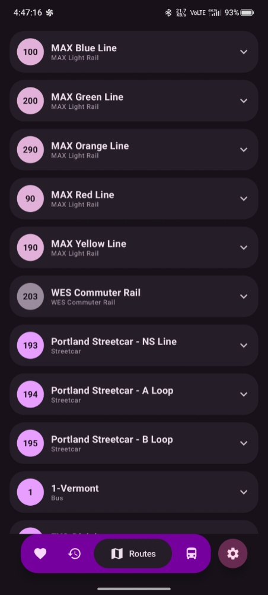
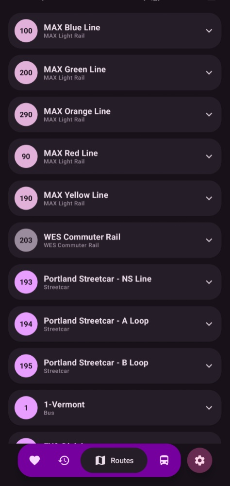
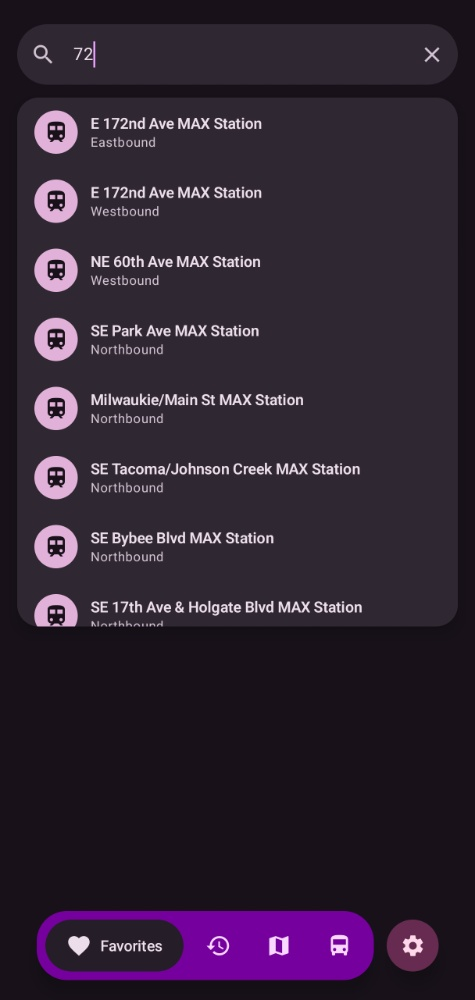
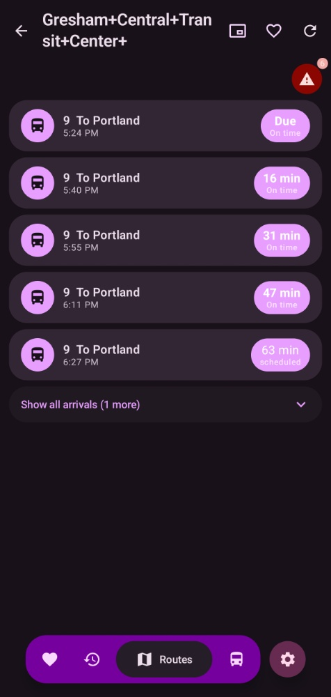
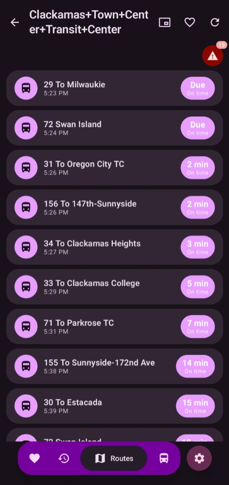
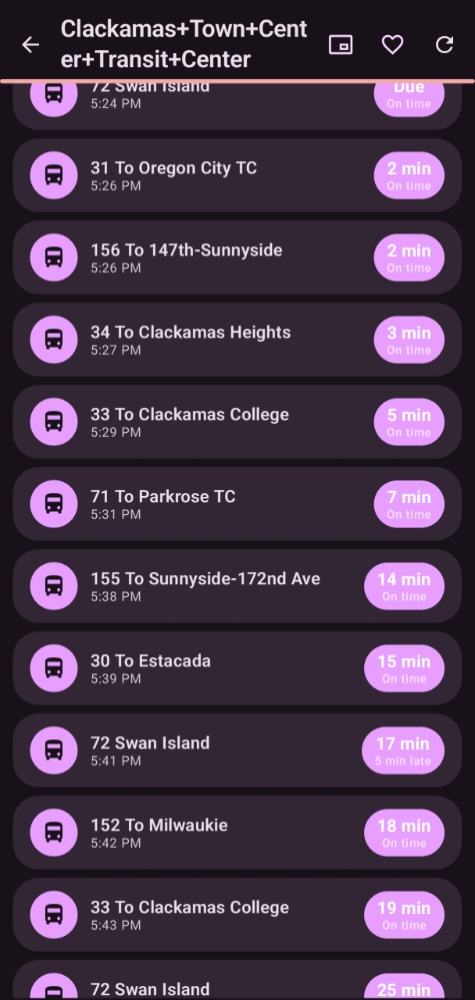
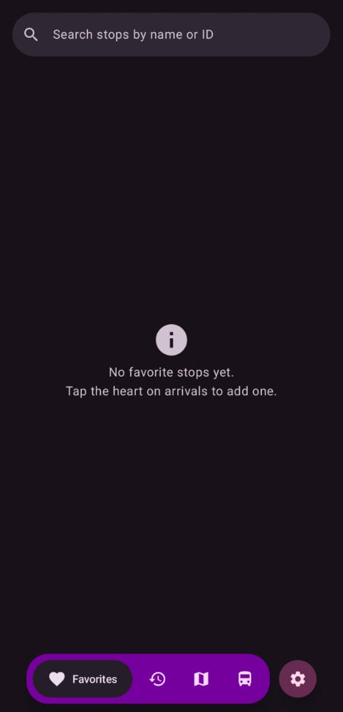
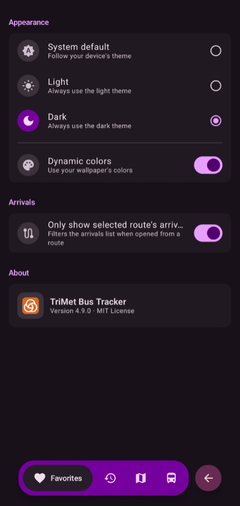

# TriMet Bus Tracker

Real-time transit tracker for Portland, OR's TriMet system — bus, MAX Light Rail, Streetcar, and WES Commuter Rail — built with Jetpack Compose + Material 3.

*TriMet and TransitTracker are registered trademarks of TriMet. All rights reserved.*

## Features

- **Real-time arrivals** — live departure countdowns at any stop, per-run bus positions on a map card, pull-to-refresh, and auto-refresh when the app returns to the foreground
- **Live "What's Nearby" map** — MapLibre GL map of nearby vehicles, stops, and your location on OpenFreeMap vector tiles (no API key required)
- **Route & stop browser** — routes → directions → stops in an animated accordion drill-down
- **Nearby stops** — find stops around your current GPS location
- **Stop search** — instant client-side search by name, right on the Home screen
<<<<<<< HEAD
- **Favorites & recent stops** — saved locally in SQLite; the Favorites pill always lands on the Favorites tab
- **Floating pill navigation** — a Material 3 Expressive pill bottom bar with a fixed Favorites / Recent / Routes / What's Nearby item set, swipeable screens, and a trailing Settings button (becomes a Back button on Settings)
||||||| c1b1ff1
- **Stop search** — instant client-side search by name
- **Favorites & recent stops** — saved locally in SQLite; the Home button always lands on the Favorites tab
- **Floating pill navigation** — a Material 3 Expressive pill bottom bar for Home, Routes, What's Nearby, and Search, with swipeable screens and a Settings button
=======
- **Favorites & recent stops** — saved locally in SQLite; the Home button always lands on the Favorites tab
- **Floating pill navigation** — a Material 3 Expressive pill bottom bar for Home, Routes, and What's Nearby, with swipeable screens and a Settings button
>>>>>>> v4.9.0
- **Service alerts & detours** — active TriMet alerts for the stop and its routes
- **Picture-in-picture** — mini-window countdown on the arrivals screen (2:3 PiP)
- **Dynamic theming** — Material 3 with Android 12+ dynamic color; system/light/dark override in Settings
- **Route-pinned mode** — optional setting to show only the arrivals for the route you opened the stop from

## Screenshots

| | | |
|---|---|---|
|  |  |  |
| Transit routes list view (1) | Transit routes list view (2) | Search results for route 72 |
|  |  |  |
| Route 9 arrivals at Gresham Central | Multiple-route arrivals at Clackamas Town Center (1) | Multiple-route arrivals at Clackamas Town Center (2) |
|  |  |  |
| Empty Favorites page | Empty Recent Stops page | Settings menu |

## Requirements

- Android 12+ (minSdk 31, targetSdk/compileSdk 37)
- JDK 21 locally (CI builds with JDK 17)
- Android SDK platform 37

## Architecture

11 Gradle modules in four strictly downward layers (no module→app or feature→feature edges):

| Layer | Modules |
|---|---|
<<<<<<< HEAD
| `app` | single Activity, Compose Navigation graph, floating pill nav + trailing Settings/Back button, PiP |
||||||| c1b1ff1
| `app` | single Activity, Compose Navigation graph, floating pill nav + Settings FAB, PiP |
| `feature/*` | `home`, `stops`, `search`, `vehicles`, `arrivals`, `settings` — one screen area per module |
=======
| `app` | single Activity, Compose Navigation graph, floating pill nav + Settings FAB, PiP |
>>>>>>> v4.9.0
| `feature/*` | `home`, `stops`, `vehicles`, `arrivals`, `settings` — one screen area per module |
| `component/*` | `transit` (TriMet API client: OkHttp + JSON parsing), `localdata` (SQLite favorites/recent stops) |
| `common/*` | `model` (domain models), `utils` (connectivity, date helpers), `ui` (theme, shared Compose components, cross-screen state) |

No ViewModels, no DI framework, no Room — screens own state with `remember { mutableStateOf(...) }` and call suspend API functions.

## Building

1. **Prerequisites:** JDK 21 and Android SDK platform 37.
2. **Get an API key:** register for a free key at [developer.trimet.org](https://developer.trimet.org/appid/registration/) (required only for real live data; an empty key builds fine).
3. **Set the key** (either works):
   ```sh
   export TRIMET_API_KEY=your_key_here
   # or
   ./gradlew assembleDebug -PTRIMET_API_KEY=your_key_here
   ```
4. **Build the debug APK:**
   ```sh
   ./gradlew assembleDebug
   ```
5. **APK location:** `app/build/outputs/apk/debug/`
6. **Run the checks** (exactly what CI runs):
   ```sh
   ./gradlew clean test lint assembleDebug --stacktrace
   ```

## Tech stack

| Stack | Version |
|---|---|
| Gradle / AGP | 9.7.0 / 9.3.1 |
| Kotlin / Compose compiler plugin | 2.4.10 |
| Jetpack Compose | BOM 2026.08.00 (Material 3 1.4.0, Navigation 2.9.8) |
| OkHttp | 5.5.0 |
| Joda-Time (android.joda) | 2.14.2.1 |
| Kotlin coroutines | 1.11.0 |
| MapLibre GL Native (OpenGL backend) | 13.5.0 + OpenFreeMap tiles |

## License

This project is licensed under the MIT License — see the [LICENSE](LICENSE) file for details.

The app uses TriMet's public Web Services API. TriMet data and trademarks remain the property of TriMet.